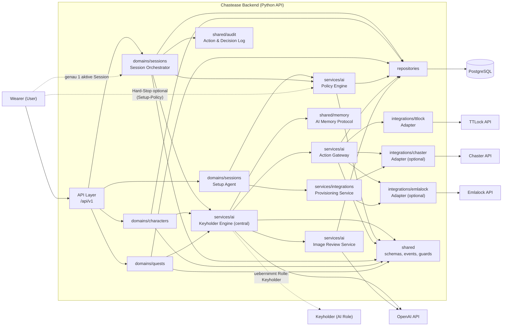

# C4 - Component View (Backend)

Dieses Diagramm zeigt die internen Komponenten der Python-API.
Die KI-Komponente steht im Zentrum der Entscheidungs- und Narrationslogik.

## Rollenmodell

- `Wearer`: menschliche Spielerrolle, steuert einen Charakter.
- `Keyholder`: wird durch die KI uebernommen und steuert Gegenpart, Dynamik und Reaktionen.
- Jeder `Wearer` ist genau einer aktiven `Session` zugeordnet.

## Verantwortlichkeiten pro Komponente

- `api/`:
  - HTTP-Eintrittspunkt, Auth, Validierung, Response-Mapping
- `domains/sessions/`:
  - Session-Lifecycle, Setup-Flow, Turn-Orchestrierung, Wearer-Session-Bindung
- `domains/characters/`:
  - Charakterwerte, Progression, regelrelevante Attribute
- `domains/quests/`:
  - Questzustand, Trigger, Fortschritt
- `services/ai/`:
  - Keyholder-Logik, Policy-Entscheidung, Prompting, Guardrails, Antwortnormalisierung
- `services/ai Action Gateway`:
  - policy-gepruefte Aktionsausfuehrung (`execute`/`suggest`)
- `services/ai Image Review`:
  - automatisierte Beurteilung von Kontrollbildern
- `integrations/*`:
  - externe API-Adapter, Integrationen benutzerwaehlbar und parallel nutzbar
- `services/integrations Provisioning`:
  - automatische Session-Anlage bei Chaster/Emlalock waehrend Setup (soweit API-seitig moeglich)
- `repositories/`:
  - persistenter Zugriff auf Sessions, Turns, Policy, Charakter- und Questzustand
- `shared/`:
  - moduluebergreifende DTOs, Events, Fehlercodes, Audit und Memory-Protokoll

## Wichtige Architekturregeln

- KI-Interaktion laeuft ausschliesslich ueber `services/ai/`.
- Domain-Module sprechen nicht direkt mit externen APIs.
- Persistenzzugriffe laufen ausschliesslich ueber `repositories/`.
- TTLock-Aktionen fuer Oeffnen/Schliessen erfordern 2-Phasenfreigabe.
- Hard-Stop (falls aktiviert) setzt externe Integrationen in sicheren Zustand.
