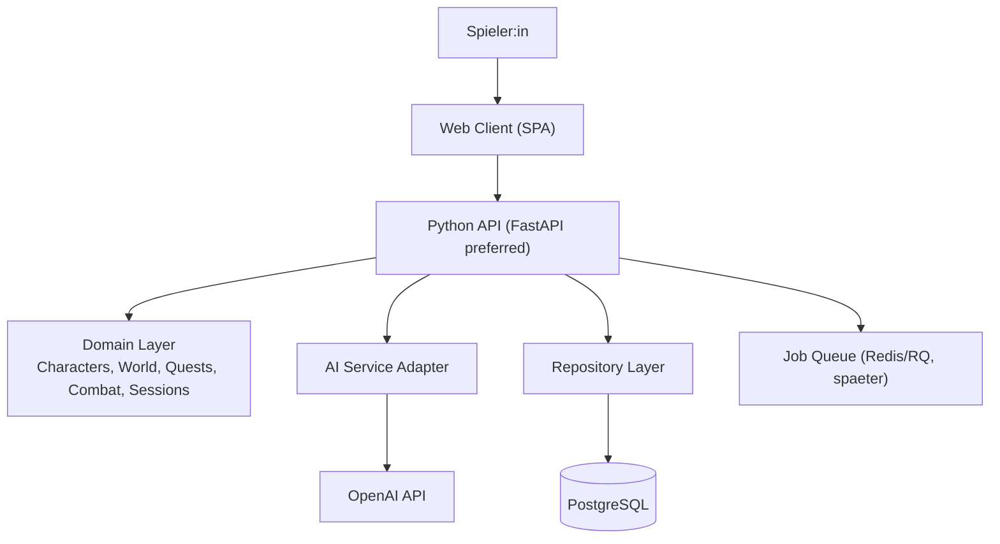

# C4 - Container View

Dieses Diagramm zeigt die zentralen Deploy-/Runtime-Container innerhalb von Chastease.

## Containerverantwortung

- Web Client:
  - Darstellung, Eingabe, Sessionsteuerung
- Python API:
  - Auth, Orchestrierung, Request/Response, Validierung
- Domain Layer:
  - Spielregeln, Zustandsuebergaenge, Use Cases
- AI Service Adapter:
  - Prompting, Antwortparsing, Guardrails, Fallbacks
- Repository Layer:
  - Datenzugriff und Transaktionsgrenzen
- PostgreSQL:
  - Persistenz von Usern, Charakteren, Sessions, Turns, World State
- Job Queue (spaeter):
  - asynchrone KI- oder Content-Generierungsjobs
