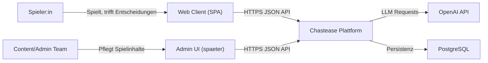

# C4 - System Context

Dieses Diagramm zeigt das Chastease-System aus externer Sicht.

## Kontextgrenzen

- Innerhalb Systemgrenze: Chastease Plattform (Backend + Fachlogik)
- Ausserhalb Systemgrenze: Spieler:innen, OpenAI API, Datenbankbetrieb, spaeter Admin-Clients
