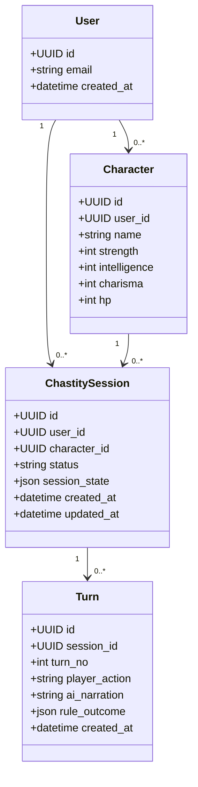

# UML - Domain Model (MVP)

Das Klassendiagramm beschreibt das fachliche Kernmodell fuer den MVP.

## Modellregeln (MVP)

- Jede Session besitzt genau einen `session_state`-Container fuer persistente Laufzeitdaten.
- Turn-Nummern sind je Session eindeutig und aufsteigend.
- Eine Session ist einem Character zugeordnet und laeuft unter genau einem User.
