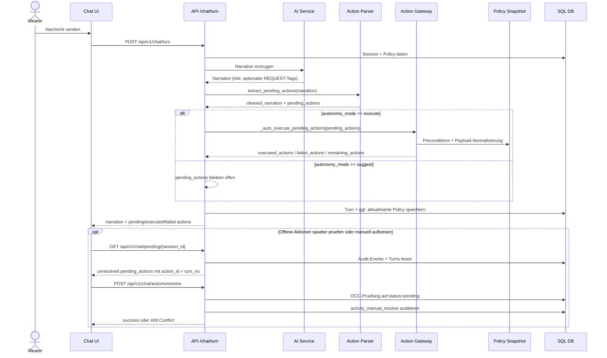

````markdown
# UML - Sequence: Chat Action Execution

Sequenz fuer den normalen Chat-Flow mit strukturierten Aktionen und Auto-Execution im `execute`-Modus.



## Kernregeln

- Ausfuehrbare Aktionen werden nur ueber das Gateway verarbeitet.
- Bei `suggest` werden keine Side-Effects ausgefuehrt.
- Narration wird um maschinenlesbare Tags bereinigt, bevor sie im UI erscheint.
- Offene Pending-Aktionen koennen spaeter ueber `GET /api/v1/chat/pending/{session_id}` abgefragt werden.
- Manuelle Aufloesung verwendet OCC und erzeugt einen separaten `activity_manual_resolve`-Audit-Event.

````
