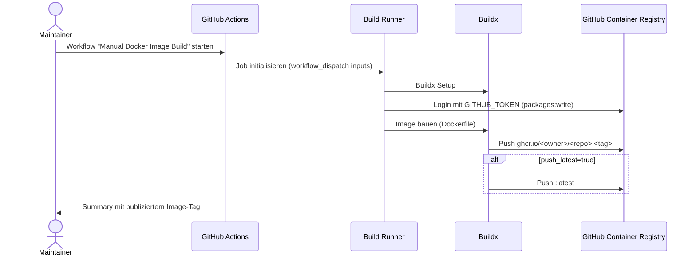

````markdown
# UML - Sequence: DevOps Manual Image Build (GHCR)

Sequenz fuer den manuellen GitHub-Workflow zum Bauen und Veroeffentlichen des Docker-Images.



## Kernregeln

- Workflow ist manuell triggerbar (`workflow_dispatch`).
- Registry-Ziel ist GHCR im selben Repository-Namespace.
- Berechtigungen: `contents:read`, `packages:write`.

````
