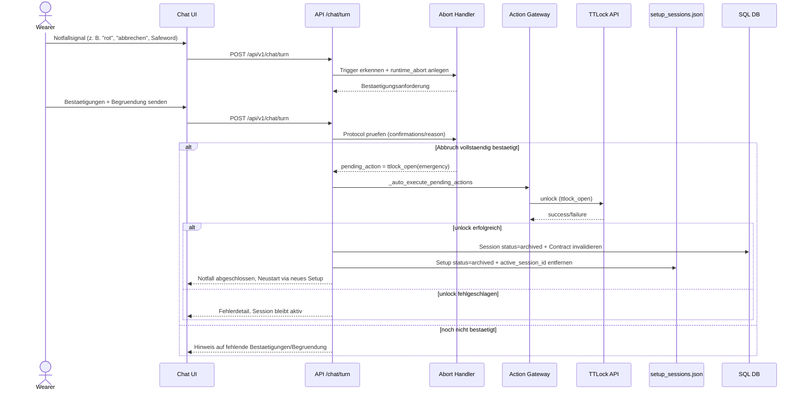

````markdown
# UML - Sequence: Emergency Abort

Sequenz fuer den Notfallabbruch inkl. direkter `ttlock_open`-Notfalloeffnung.



## Kernregeln

- Notfallpfad nutzt direkten `ttlock_open`-Mechanismus (kein `hygiene_open`).
- Archivierung/Vertragsinvalidierung nur nach erfolgreicher Oeffnung.
- Bei Unlock-Fehler bleibt die Session aktiv und reproduzierbar.

````
