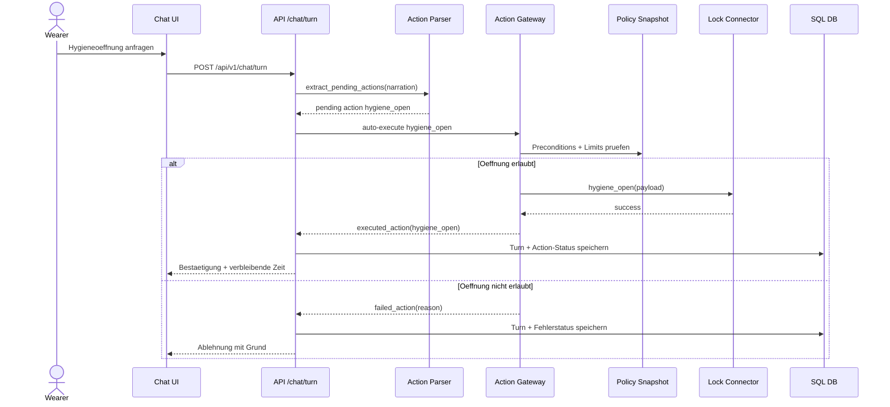

# UML - Sequence: Hygiene Opening

Sequenz fuer eine regulaere Hygieneoeffnung innerhalb einer aktiven Session.

## Kernregeln

- `hygiene_open` ist der regulaere Oeffnungspfad innerhalb einer aktiven Session.
- Limits und Preconditions werden serverseitig geprueft (nicht nur im Frontend).
- Notfallabbruch ist ein separater Pfad und nutzt direkte `ttlock_open`-Logik.
