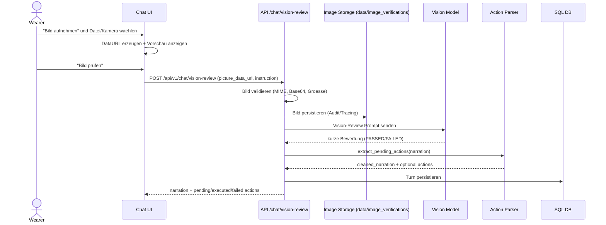

````markdown
# UML - Sequence: Image Verification

Sequenz fuer den Bildpruefungs-Workflow aus der Action-Card.



## Kernregeln

- Output ist auf kurze Bewertung reduziert (ohne separate Bildbeschreibung).
- Roh-Tags wie `[[REQUEST...]]` werden nicht im UI angezeigt.
- Bilddaten werden serverseitig groessenbegrenzt verarbeitet.

````
