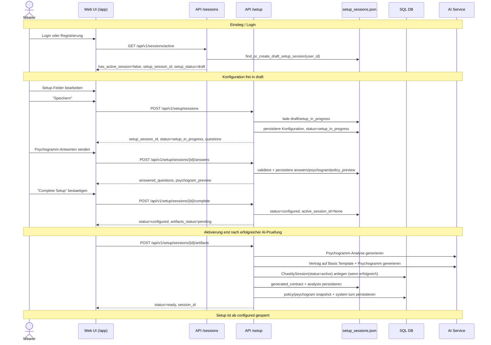

# UML - Sequence: Setup Lifecycle

Sequenz fuer den Setup-Flow mit stabilem Statuspfad:
`draft -> setup_in_progress -> configured`.

## Statusregeln

- `draft`:
  - Setup-Session existiert immer (mindestens) in diesem Status.
  - Setup-Eingaben sind editierbar.
- `setup_in_progress`:
  - Konfiguration gespeichert, Fragebogen aktiv.
  - Setup-Eingaben bleiben editierbar.
- `configured`:
  - Setup ist abgeschlossen, aber noch nicht aktiv.
  - Aktivierung erfolgt erst nach erfolgreicher Artefakt-Generierung durch die AI.
  - Setup-Eingaben sind gesperrt.
