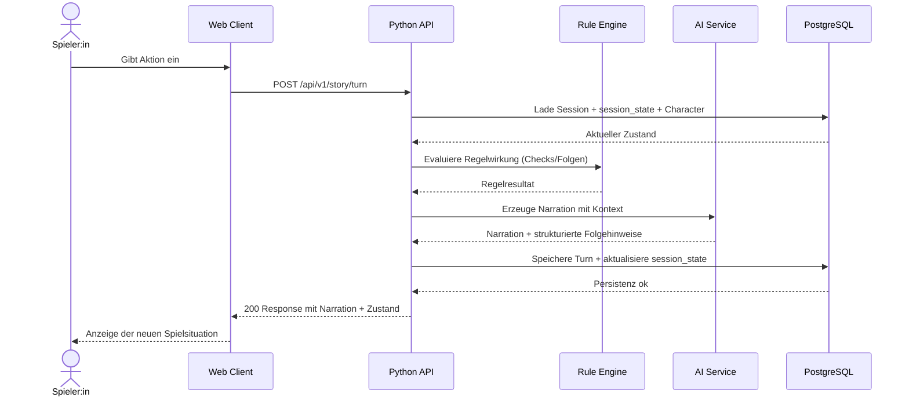

# UML - Sequence: Story Turn

Sequenz fuer den zentralen Gameplay-Flow "Spieleraktion -> KI-Reaktion -> Persistenz".

## Wichtige Varianten

- KI-Timeout: API liefert degradierte Antwort mit rein regelbasierter Narration.
- Ungueltige Aktion: API validiert und gibt 400 mit Fehlerdetails zurueck.
